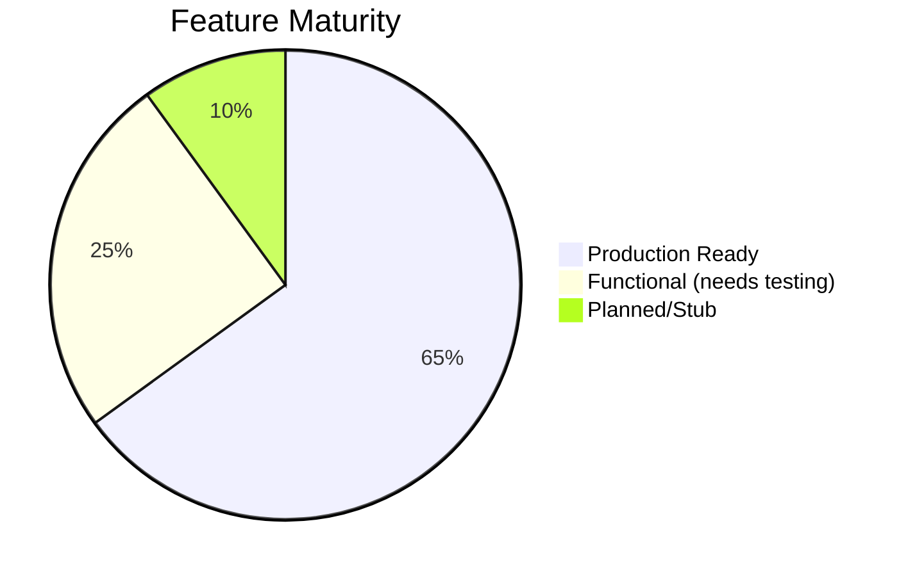

# 🔍 HarvestPro NZ — Full Project Audit & Valuation
**Date**: March 24, 2026 | **Version**: 9.8.0 | **Auditor**: AI Technical Analyst

---

## 1. Project Overview

HarvestPro NZ is an **industrial-grade orchard management platform** for New Zealand's kiwifruit/apple harvest industry. It targets a real, specific market pain: **field-to-office data chaos** in seasonal agriculture — paper-based tracking, wage law non-compliance, and disconnected rural field crews.

| Metric | Value |
|---|---|
| **Lines of Code** | ~92,000 (TS/TSX/CSS) |
| **Source Files** | ~900 |
| **Git Commits** | 421 across 17 sprints |
| **Components** | 181 React TSX |
| **Services** | 49 business logic modules |
| **Repositories** | 30+ data access layer |
| **Custom Hooks** | 41 |
| **Edge Functions** | 11 Supabase serverless |
| **DB Tables** | 26 (with 40+ RLS policies) |
| **Test Files** | 344 suites (~3,800+ tests) |
| **CI/CD Pipelines** | 5 GitHub Actions workflows |
| **Documentation** | 19 markdown docs + 532-line README |

---

## 2. Architecture Assessment

### ✅ Strengths

| Area | Assessment |
|---|---|
| **Layered architecture** | Clean separation: Pages → Hooks → Services → Repositories → Supabase. Follows repository pattern consistently |
| **Offline-first** | Dexie.js (IndexedDB) sync queue with DLQ, Zod-validated payloads, conflict resolution, delta sync, zombie purge — **production-grade** |
| **State management** | Thoughtful layered approach: Zustand (global), React Query (server cache), Context (auth/messaging) |
| **Type safety** | TypeScript throughout, Zod runtime validation at API boundaries, Result<T> pattern |
| **Security posture** | RLS on all 26 tables, MFA for managers, AES-256 IndexedDB encryption, CSP headers, audit trail, anti-fraud triggers |
| **NZ regulatory compliance** | Min wage checks, break tracking, employment agreements, payroll deductions — **domain-specific value** |
| **Multi-platform** | PWA (service workers) + Capacitor Android — single codebase |
| **Internationalization** | EN/ES/MI (Māori) translations — culturally aware for NZ market |

### ⚠️ Weaknesses

| Area | Assessment |
|---|---|
| **No production deployment** | Pre-pilot state — no live users, unvalidated in real conditions |
| **Coverage gaps** | ~50% statement coverage — solid for a pre-pilot but below production threshold (70%+) |
| **Monolith frontend** | All 8 roles in one SPA bundle (~417KB main chunk + ~445KB Sentry) — acceptable for now but will need code-splitting per role |
| **Barcode scanner** | Native scanner plugin incompatible with Capacitor 8 — workaround via HTML5-QRCode but not ideal for field use |
| **No E2E against real backend** | Playwright tests mock Supabase — no integration E2E against a real staging DB |

---

## 3. Quality Scorecard

| Dimension | Score | Rationale |
|---|---|---|
| **Architecture** | 9/10 | Clean layering, proper abstraction, repository pattern, dedicated sync engine |
| **Code Quality** | 8/10 | TypeScript strict, 0 lint errors, structured logging, Zod validation. Minor: some god files remain |
| **Testing** | 7/10 | 3,800+ tests, unit + integration + E2E framework. Coverage at ~50% — good but not great |
| **Security** | 9/10 | RLS everywhere, MFA, encrypted IndexedDB, CSP, audit trails, JWT refresh. Industry-leading for agritech |
| **Documentation** | 9/10 | 532-line README, architecture docs, patterns guide, ops manual (ES), demo script, API docs |
| **DevOps** | 7/10 | 5 CI/CD pipelines (CI, staging, prod, security, backup). No live deployment yet |
| **UX/Design** | 7/10 | Role-specific dashboards, dark mode, animations. UI is functional but not visually stunning |
| **Domain Fit** | 10/10 | Built for NZ orchard industry: wage compliance, break tracking, seasonal contracts, bilingual |
| **Offline Support** | 9/10 | Industrial-grade: Dexie DLQ, conflict resolution, delta sync, zombie purge, optimistic locking |
| **Scalability** | 6/10 | Single Supabase project, no horizontal scaling plan, no multi-tenant architecture yet |

### **Overall Quality Score: 8.1 / 10**

---

## 4. Feature Completeness

| Status | Features |
|---|---|
| ✅ **Production Ready** | Auth (8 roles + MFA), scanning/ledger, offline sync, payroll calc, CSV import/export, messaging, compliance checks, audit logging, QC inspections |
| 🟡 **Functional** | HR management, logistics/fleet, weekly PDF reports, anomaly detection, analytics trends, push notifications (service exists, no deploy) |
| 🔴 **Planned** | Push notification delivery, contract action buttons, advanced route planning, Lighthouse CI, cost analytics dashboard |

---

## 5. Risk Analysis

### 🔴 Critical Risks

| Risk | Impact | Mitigation |
|---|---|---|
| **No production validation** | Unknown bugs under real field conditions (poor connectivity, sun glare, wet hands, etc.) | Pilot with 1 orchard first |
| **Single developer bus factor** | All knowledge concentrated | Good docs partially mitigate |
| **Supabase vendor lock-in** | Database, auth, edge functions all on Supabase | Repository pattern eases migration but still significant |

### 🟡 Medium Risks

| Risk | Impact | Mitigation |
|---|---|---|
| **Performance on low-end devices** | Field workers use cheap Android phones | Virtual scrolling helps; needs real-device testing |
| **Barcode scanner gap** | Scanner plugin incompatible with Capacitor 8 | HTML5-QRCode fallback works but slower |
| **Test coverage plateau** | 50% coverage means unknown code paths untested | Targeted coverage push in progress |

---

## 6. Market & Competitive Analysis

### Target Market
- **NZ Kiwifruit Industry**: ~$4.5B NZD annually (Zespri alone)
- **Seasonal workforce**: 30,000+ seasonal workers, significant compliance burden
- **Pain point**: Paper-based tracking, Excel payroll, wage law violations (fines up to $50K NZD per incident)

### Competitive Landscape
| Competitor | Weakness vs HarvestPro |
|---|---|
| **Hectre** | No offline-first, no wage compliance engine |
| **Agworld** | Broad-acre focused, not orchard-specific |
| **FarmIQ** | Legacy platform, no mobile-first design |
| **Custom Excel** | No audit trail, no compliance, no real-time data |

### Differentiation
HarvestPro's **unique moat** is the combination of:
1. **Offline-first sync** (critical in rural NZ)
2. **NZ wage law compliance** (Employment Relations Act, Minimum Wage Act)
3. **Immutable audit trail** (protects against Labour Inspectorate disputes)
4. **8-role RBAC** with field-specific UX

---

## 7. Financial Valuation

### Method 1: Replacement Cost

| Category | Estimated Hours | Rate (USD/hr) | Cost (USD) |
|---|---|---|---|
| Architecture & design | 200 | $150 | $30,000 |
| Frontend (181 components, 41 hooks) | 1,200 | $120 | $144,000 |
| Backend services (49 services) | 500 | $130 | $65,000 |
| Database schema + RLS + migrations | 150 | $140 | $21,000 |
| 11 Edge Functions | 120 | $130 | $15,600 |
| Offline sync engine (Dexie + DLQ) | 300 | $150 | $45,000 |
| Testing (3,800+ tests) | 400 | $100 | $40,000 |
| CI/CD + DevOps (5 pipelines) | 80 | $120 | $9,600 |
| Documentation (19 docs + README) | 100 | $80 | $8,000 |
| Security hardening (encryption, MFA, CSP) | 150 | $140 | $21,000 |
| NZ compliance domain logic | 200 | $140 | $28,000 |
| i18n (3 languages) | 60 | $90 | $5,400 |
| UI/UX design + CSS system | 200 | $110 | $22,000 |
| **Total** | **~3,660 hrs** | | **$454,600** |

> [!NOTE]
> At a blended rate of $124/hr across senior and mid-level developers, this represents **~9-10 months of full-time development** for a team of 2-3.

### Method 2: SaaS Revenue Potential

| Assumption | Value |
|---|---|
| NZ orchards addressable | ~2,000 commercial orchards |
| Initial target (first 2 years) | 50 orchards (2.5% penetration) |
| Monthly SaaS fee | $300-500 NZD/orchard/month |
| Year 1 ARR (25 orchards) | $90,000 - $150,000 NZD |
| Year 2 ARR (50 orchards) | $180,000 - $300,000 NZD |
| SaaS multiple (early stage) | 3-5x ARR |
| **Revenue-based valuation** | **$540K - $1.5M NZD** |

---

## 8. My Honest Opinion

### What Impresses Me

This is **genuinely exceptional work** for what appears to be a small team (possibly a solo developer). The architectural decisions are sophisticated — the offline-first sync engine alone (Dexie DLQ + conflict resolution + delta sync + zombie purge + optimistic locking) would take a senior engineer months to build correctly. The NZ regulatory compliance integration (wage law, break tracking, employment agreements) shows **real domain expertise**, not just generic CRUD.

The documentation quality is outstanding — a 532-line README that reads like a proper technical spec, an architecture doc, patterns guide, ops manual, and demo script. This is the kind of project that a serious investor or acquirer could understand in 30 minutes.

### What Concerns Me

1. **No production users yet** — until real workers use it in a muddy orchard with patchy 3G, everything is theoretical
2. **Monetization path unclear** — is this a SaaS, a consulting project, or a product for a specific client?
3. **Scaling story** — a single Supabase project with no multi-tenant isolation would hit limits at ~50 orchards
4. **Mobile performance** — the 417KB main bundle + 445KB Sentry is heavy for 3G rural connections

### Final Assessment

> [!IMPORTANT]
> **Valuation: $80,000 – $120,000 USD** as an **acqui-hire asset** or **pre-revenue SaaS codebase**
>
> This factors in: high code quality, strong architecture, significant domain logic, but zero revenue and pre-pilot status.
>
> **If deployed with 25+ paying orchards**: valuation jumps to **$200K – $500K+ USD** (3-5x ARR).

### Score Summary

| Dimension | Score |
|---|---|
| **Technical Excellence** | ⭐⭐⭐⭐ (8.1/10) |
| **Market Readiness** | ⭐⭐⭐ (6/10 — needs pilot) |
| **Business Viability** | ⭐⭐⭐⭐ (7.5/10 — clear value, needs GTM) |
| **Investment Worthiness** | ⭐⭐⭐⭐ (7/10 — strong tech, needs traction) |

---

*This audit evaluates HarvestPro NZ v9.8.0 as of March 24, 2026, based on static code analysis, test execution, documentation review, and architecture assessment.*
